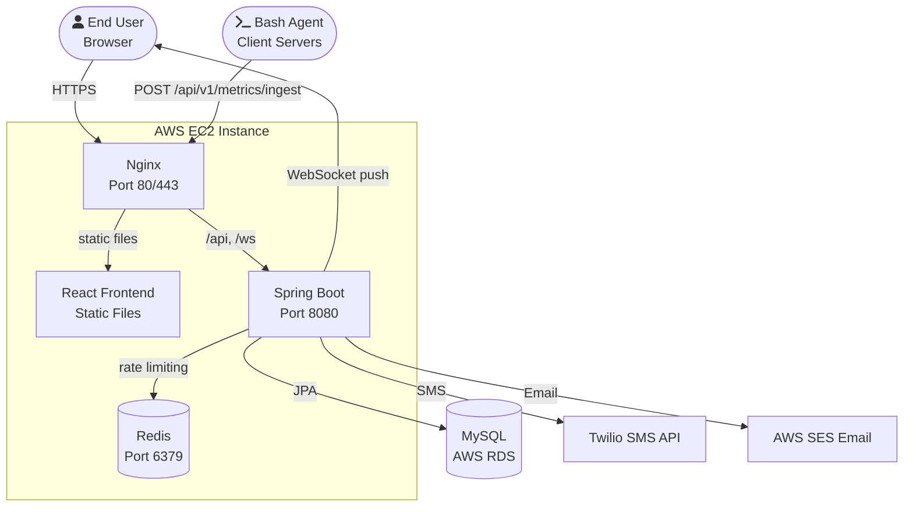
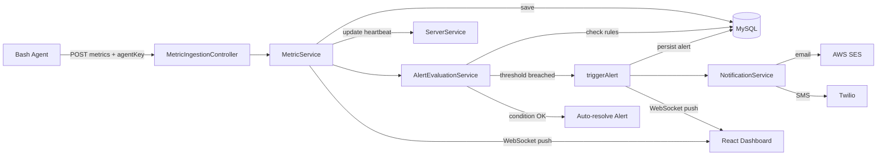
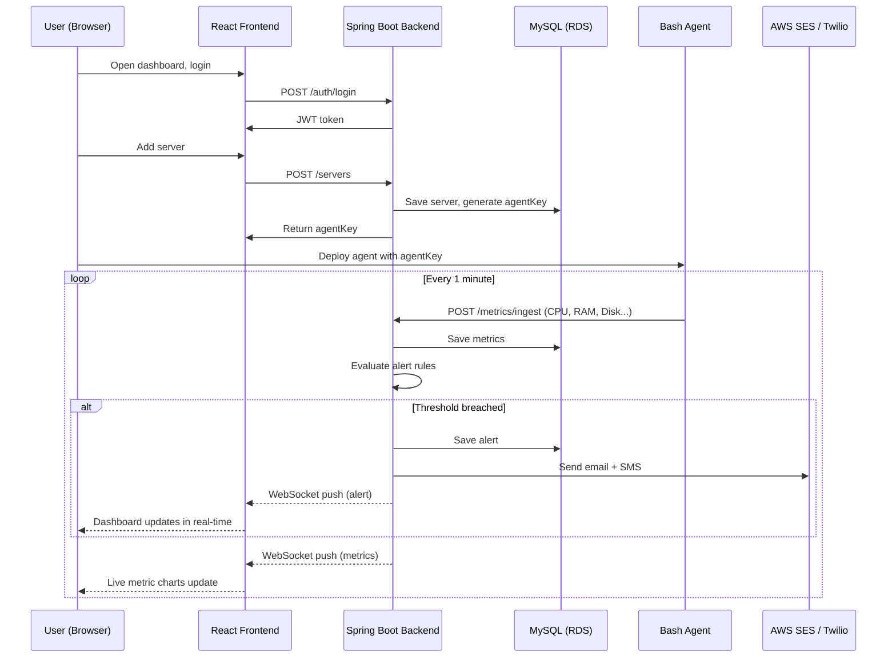
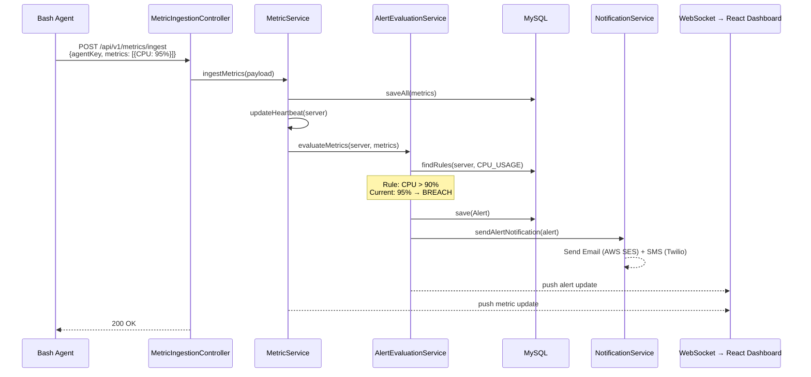

# Assignment 5 — Deployment & Implementation Details

**Course:** CS 331 — Software Engineering Lab  
**Project:** Argus (Real-time Server Monitoring and Alerting System)  
**Team:** NightsWatch

---

## 1. Hosting & Deployment Strategy [5 Marks]

### Components & Target Hosts

To keep things cost-effective and simple, we are relying mostly on AWS Free Tier:

| Component | Where it's Hosted | Details |
| :--- | :--- | :--- |
| **React Frontend** | AWS EC2 (served by Nginx) | Nginx serves the static built files over port 80/443 |
| **Spring Boot Backend** | AWS EC2 | Runs as a `systemd` background service on port 8080 |
| **MySQL Database** | AWS RDS | Managed database, port 3306 |
| **Redis Cache** | AWS EC2 | Running locally on the same instance, port 6379 |
| **Bash Agent** | Target Client Servers | Can be any Linux machine the user wants to monitor |

### Step-by-Step Deployment

1. **Build the Application**
   - Package the backend using Maven: `./mvnw clean package -DskipTests`
   - Build the React SPA into static files: `npm run build`
2. **Transfer Files to EC2**
   - Use `scp` to copy the generated `Argus.jar` and the frontend `dist/` folder to the EC2 server.
3. **Configure the Environment**
   - Update `application.properties` on the server with production credentials (RDS database URL, Redis host, AWS SES keys for email, and JWT secret).
4. **Start the Backend**
   - Run the Spring Boot app as a linux `systemd` service so it automatically restarts if it crashes.
5. **Setup Nginx**
   - Configure Nginx to serve the React files at the root `/`.
   - Setup reverse proxies for `/api/*` and WebSocket connections (`/ws`) to forward traffic to the Spring Boot app running on port 8080.
6. **Deploy the Agent**
   - The user copies `argus-agent.sh` to their machine, sets the `AGENT_KEY`, and adds it to their `crontab` to run every minute.

### Security Implementation

- **API Security:** All protected endpoints require a JWT token (expires every 24 hours).
- **Agent Authentication:** Metric ingestion doesn't use JWT; instead, it requires the secret `agentKey` passed in the payload.
- **Passwords:** Handled using BCrypt hashing.
- **Infrastructure:** The RDS database is kept in a private subnet, meaning it cannot be reached from the public internet, only from our EC2 instance.
- **DDoS/Spam Protection:** We use Redis to rate-limit Twilio SMS notifications.

---

## 2. User Access & Component Interaction [10 Marks]

End users have three primary ways of interacting with Argus:

1. **Web Dashboard:** The standard browser interface where users sign up, add servers, define alert thresholds, and watch live charts.
2. **Bash Agent:** A passive interaction point. Server admins install the script once, and it consistently pushes hardware metrics every minute.
3. **Notifications:** Users passively receive critical system alerts via email (AWS SES) and text message (Twilio).

### Overview Architecture Diagram

### Component Flow

### Basic Usage Sequence

---

## 3. Component Implementations [10 Marks]

The actual implementations for these parts have already been coded and exist in the repository:
- **Backend APIs & Logic:** Located in `src/main/java/nightswatch/argus/`
- **Frontend SPA:** Located in `Argus_Frontend/src/`
- **Agent Bash Script:** Located in `agent/argus-agent.sh`

### How the core components talk to each other

When an agent pushes a new performance metric, this is the exact flow that takes place under the hood:

