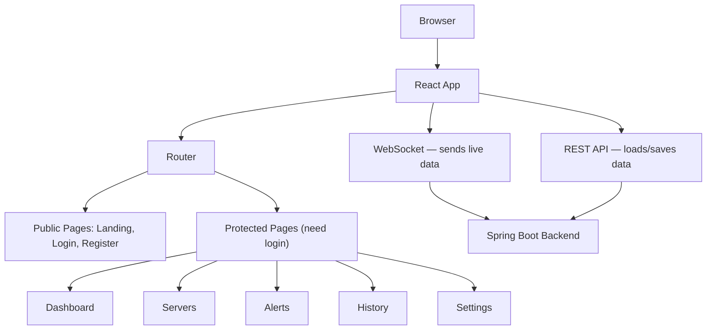
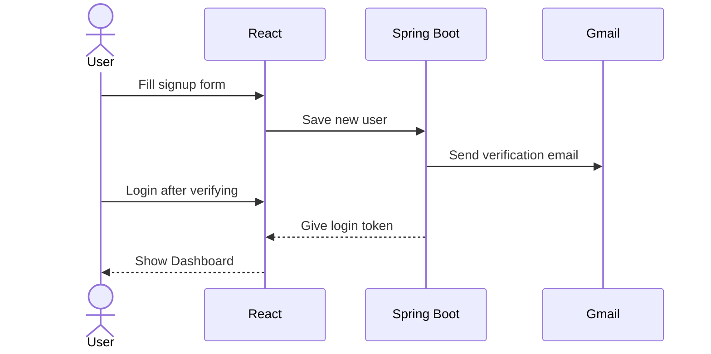
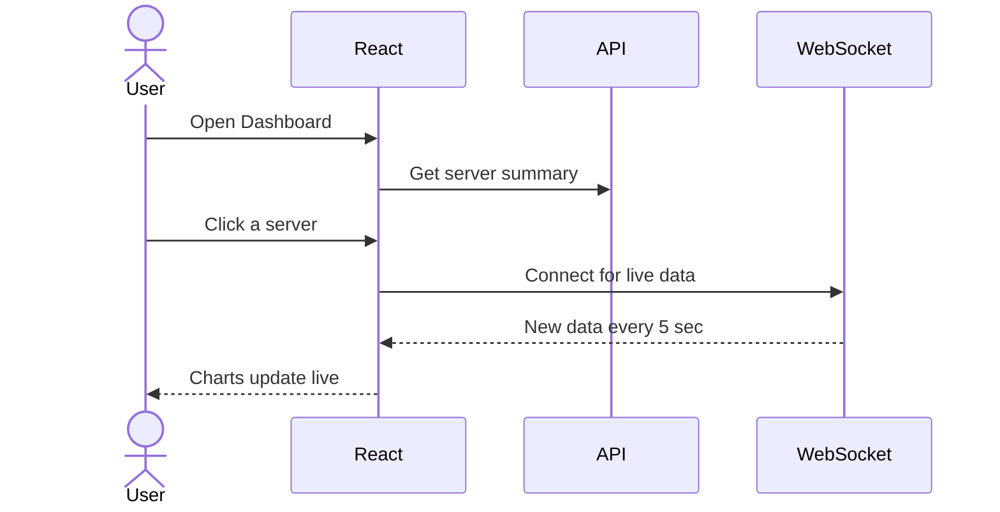
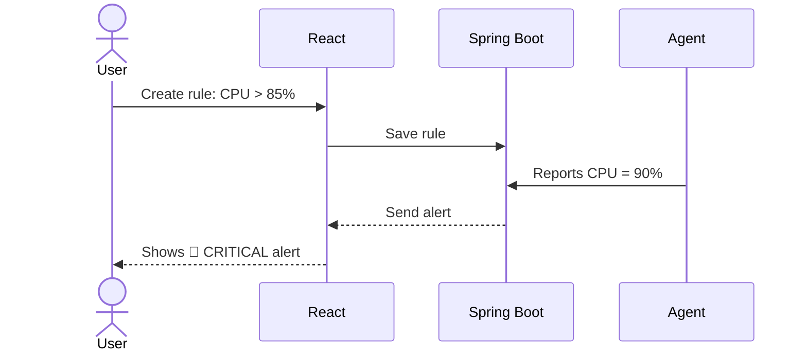
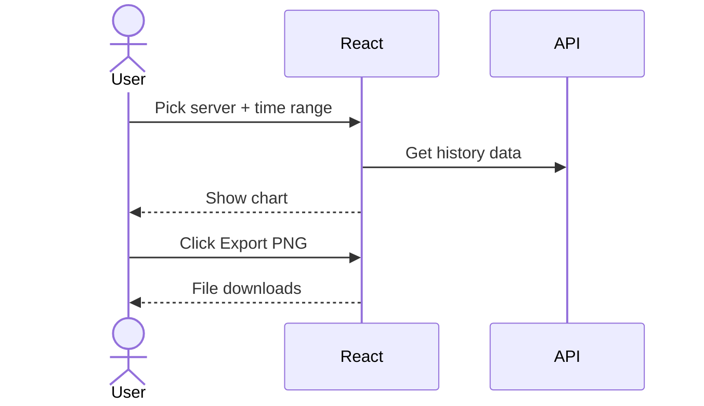

# Assignment 6 — Argus: UI Design & Implementation

> **Course:** CS 331 — Software Engineering Lab | **Marks:** 20 | **Team:** NightsWatch
>
> **Project:** Argus — Server Monitoring System | **Repo:** [github.com/ziyadhussain23/Argus](https://github.com/ziyadhussain23/Argus)

---

# Part I — Why We Chose This UI [10 Marks]

## Our Choice: Web-Based GUI (Direct Manipulation Interface)

We built Argus as a **website** where users click buttons, view live charts, and toggle switches — just like any modern web app.

> Think of a car dashboard — you don't type commands to check speed, you just look at it. Argus works the same way for servers.

### 5 Reasons

1. **Charts show live data best** — CPU/memory updates every 5 seconds. Only charts can show this clearly.
2. **Easy to move around** — Sidebar lets users switch between pages in one click.
3. **Anyone can use it** — Simple buttons, forms, and toggles. No coding knowledge needed.
4. **Complex data display** — History page: select server + time frame → view chart → export as PNG/PDF/CSV/JSON — all in one screen.
5. **No install needed** — Just open the browser and start using it.

### Why Not Other UI Types?

| UI Type | Why Not? | |
| --- | --- | --- |
| CLI (Command Line) | Can't show charts or graphs | ❌ |
| Menu-Based | Too slow, can't show live data | ❌ |
| Form-Based | Monitoring = watching, not filling forms | ❌ |
| Voice/Natural Language | Too slow for urgent alerts | ❌ |
| **Web GUI** | **Shows live charts, easy to navigate** | ✅ |

### How the App is Built



---

# Part II — What We Built [10 Marks]

## Tools Used

| Part | Tools |
| --- | --- |
| Frontend | React, TypeScript, Tailwind CSS, shadcn/ui, Recharts |
| Live Data | WebSocket (STOMP/SockJS) |
| Backend | Spring Boot (Java), MySQL, Redis, JWT |

## How Pages Connect


---

## 1. Landing Page
Home page with **Get Started** and **Sign In** buttons.


```tsx
<Button onClick={() => navigate("/register")}>Get Started</Button>
<Button onClick={() => navigate("/login")}>Sign In</Button>
```

## 2. Login Page
User types email + password → app saves login token → goes to Dashboard.


```tsx
await login(values.email, values.password);
navigate("/dashboard");
```

## 3. Register Page
Signup form. After signing up, a verification email is sent.


```tsx
await register(values.name, values.email, values.password);
toast({ title: "Account created! Please verify your email." });
```

## 4. Dashboard
Shows 4 cards: Total Servers, Online, Active Alerts, Avg CPU — plus server list.


```tsx
<MetricCard title="Total Servers" value={summary?.totalServers} />
<MetricCard title="Online" value={summary?.online} color="green" />
<MetricCard title="Active Alerts" value={summary?.activeAlerts} color="red" />
```

## 5. Servers Page
Lists all servers with colored status badges. "Add Server" button to add new ones.


```tsx
<Button onClick={() => setAddOpen(true)}>Add Server</Button>
{servers?.map(s => <ServerCard key={s.id} server={s} />)}
```

## 6. Server Detail
4 live charts (CPU, Memory, Disk, Network) that update every 5 seconds — no refresh needed.


```tsx
client.subscribe(`/topic/server/${id}/metrics`, (msg) => {
  const data = JSON.parse(msg.body);
  setMetrics(prev => [...prev.slice(-60), data]);
});
```

## 7. Alerts Page
Shows all alerts. Filter by: All, Active, or Resolved. Colors: 🔴 Critical, 🟡 Warning, 🔵 Info.


```tsx
{["all", "active", "resolved"].map(f => (
  <Button onClick={() => setFilter(f)}>{f}</Button>
))}
```

## 8. Alert Rules
Set rules like "Alert me if CPU > 85%". Each rule has an on/off switch.


```tsx
<TableCell>{rule.metric} > {rule.threshold}%</TableCell>
<TableCell><Switch checked={rule.enabled} onCheckedChange={() => toggleRule(rule.id)} /></TableCell>
```

## 9. History Page
Pick a server and time range → see chart → download as PNG, PDF, CSV, or JSON.


```tsx
<ServerSelector value={serverId} onChange={setServerId} />
<TimeFrameSelector value={timeFrame} onChange={setTimeFrame} />
<AreaChart data={historyData} />
```

## 10. Settings
Edit profile, turn email alerts on/off, switch between dark and light theme.


```tsx
<Switch checked={emailAlerts} onCheckedChange={setEmailAlerts} />
<ThemeToggle /> {/* Dark/Light mode */}
```

---

## Shared Components (used on many pages)

| Component | What it does |
| --- | --- |
| **Sidebar** | Left menu for navigation. Shows which page is active. Has a 🟢/🔴 connection light. |
| **StatusBadge** | Colored label — green (Online), yellow (Warning), red (Critical), gray (Offline) |
| **MetricCard** | Shows one number with icon, like "CPU: 72%" |
| **ThemeToggle** | Button to switch dark/light mode. Remembers your choice. |


---

## How Users Interact (4 Flows)

### Flow 1: Sign Up → Login → See Dashboard



### Flow 2: Open Server → Watch Live Charts



### Flow 3: Set Alert Rule → Get Notified



### Flow 4: View History → Download Report



---

## Quick Summary

| What | Details |
| --- | --- |
| Pages | 10 (Landing, Login, Register, Dashboard, Servers, Server Detail, Alerts, Alert Rules, History, Settings) |
| Live Data | Charts update every 5 sec via WebSocket |
| Security | JWT tokens — must login to see pages |
| Export | PNG, PDF, CSV, JSON |
| Theme | Dark/light mode, saved in browser |
| Alerts | Email + in-app with colored severity badges |
