# CS 331 — Assignment 6 | Argus: UI Design & Implementation

> **Course:** CS 331 — Software Engineering Lab | **Assignment:** 6 | **Total Marks:** 20
>
> **Project:** Argus — Real-Time Server Monitoring & Alert System | **Team:** NightsWatch
>
> **Repo:** [https://github.com/ziyadhussain23/Argus](https://github.com/ziyadhussain23/Argus)

---

# Part I — UI Choice & Justification [10 Marks]

## UI Type Chosen: Direct Manipulation Interface (Web-Based GUI)

We chose a **Direct Manipulation Interface** — users interact by **clicking buttons, viewing live charts, toggling switches, and reading visual indicators** in a web browser.

> Like a car dashboard — you don't type commands to see your speed. You just look at it. Argus works the same way for servers.

### Why This UI — 5 Reasons

1. **Live data needs visual charts** — CPU/memory changes every 5 seconds via WebSocket. Only charts can show this clearly.
2. **10+ pages need easy navigation** — Sidebar lets users jump between Dashboard, Servers, Alerts, History, Settings in one click.
3. **Easy for non-technical users** — Standard buttons, forms, toggles, inline error messages, dark/light theme.
4. **Complex data display** — History page: select server + time frame → view chart → export as PNG/PDF/CSV/JSON — all in one screen.
5. **No installation needed** — Works in any browser. Just open the link and start monitoring.

### Comparison Table

| **UI Type** | **Problem for Argus** | **Decision** |
| --- | --- | --- |
| Command Language (CLI) | Cannot show charts. No visual overview. | ❌ Rejected |
| Menu-Based Interface | Too slow for 10+ pages. No live data. | ❌ Rejected |
| Form Fill-In Interface | Monitoring = viewing, not entering data. | ❌ Rejected |
| Natural Language Interface | Too slow for critical monitoring alerts. | ❌ Rejected |
| **Direct Manipulation (Web GUI)** | Perfect for real-time visual monitoring. | ✅ Chosen |

### UI Architecture

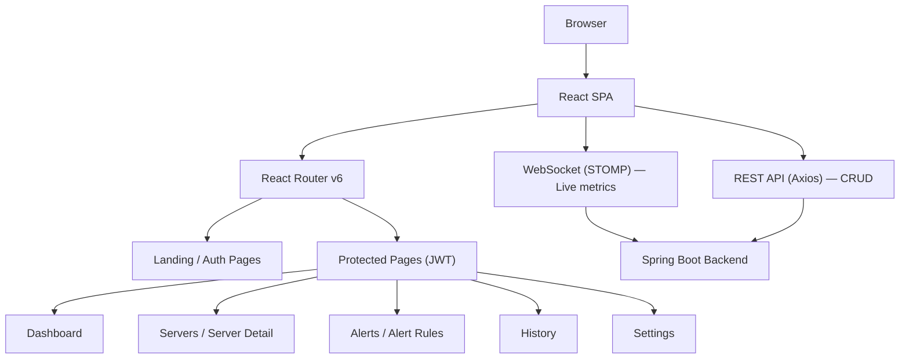

---

# Part II — UI Implementation & User Interactions [10 Marks]

## Tech Stack

| Layer | Tools |
| --- | --- |
| Frontend | React 18, TypeScript, Tailwind CSS, shadcn/ui, Recharts |
| Routing | React Router v6 |
| Real-time | WebSocket (STOMP/SockJS) |
| API | Axios + React Query |
| Backend | Spring Boot (Java), MySQL, Redis, JWT Auth |

## Page Map

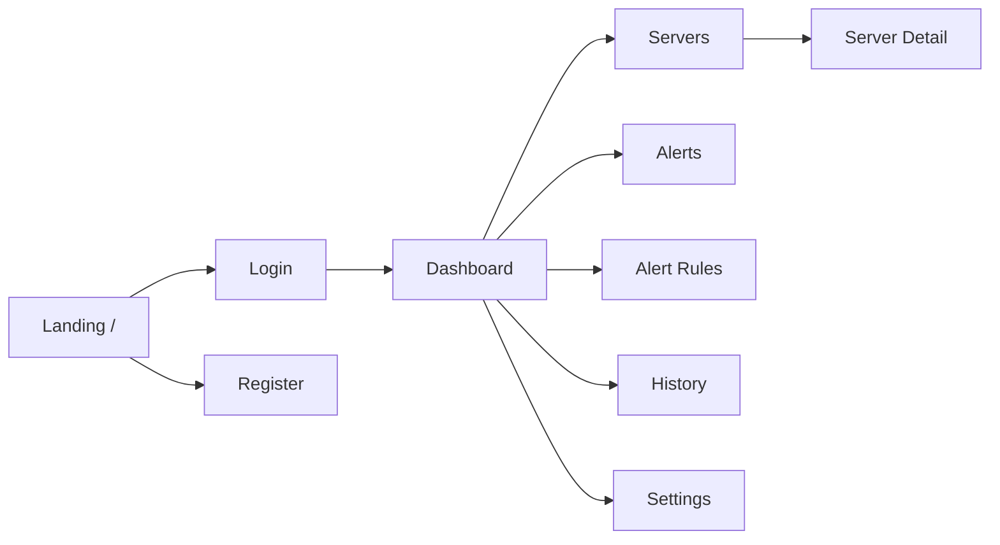

---

## 1. Landing Page

First page users see — product intro with **Get Started** and **Sign In** buttons.

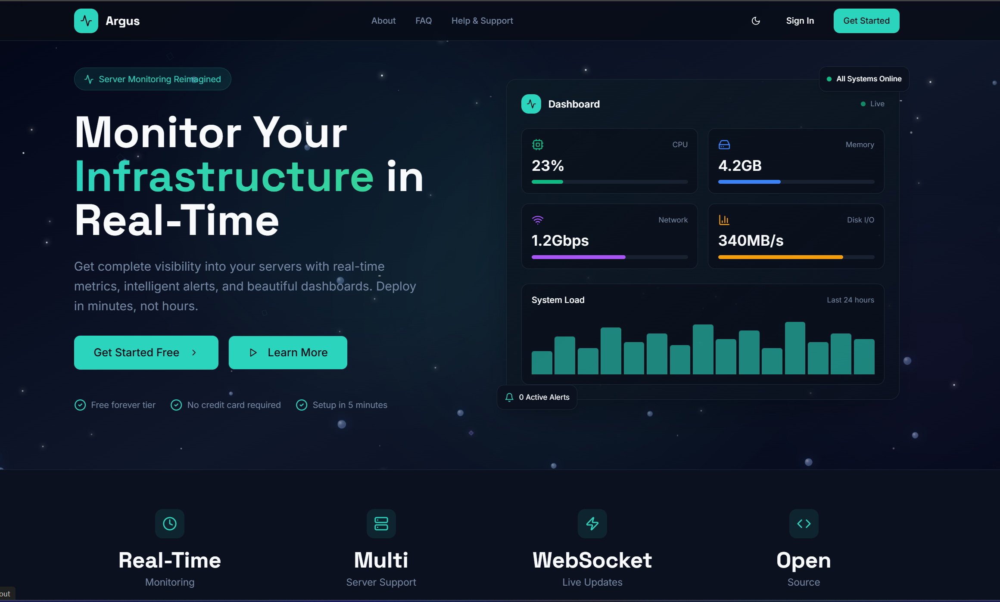

```tsx
<Button size="lg" onClick={() => navigate("/register")}>Get Started</Button>
<Button size="lg" variant="outline" onClick={() => navigate("/login")}>Sign In</Button>
```

## 2. Login Page

Email + password form with inline validation. On success → JWT token saved → redirect to Dashboard.

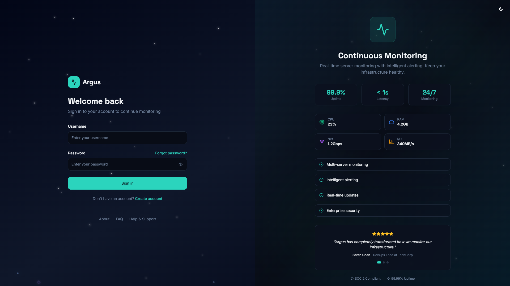

```tsx
const onSubmit = async (values) => {
  await login(values.email, values.password);
  navigate("/dashboard");
};
```

## 3. Register Page

Signup form with password strength rules. Sends verification email after registration.

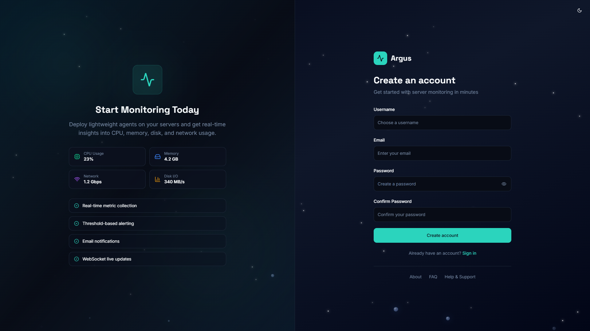

```tsx
const onSubmit = async (values) => {
  await register(values.name, values.email, values.password);
  toast({ title: "Account created!", description: "Please verify your email." });
};
```

## 4. Dashboard

Main page after login — 4 summary cards (Total Servers, Online, Active Alerts, Avg CPU) + server list.

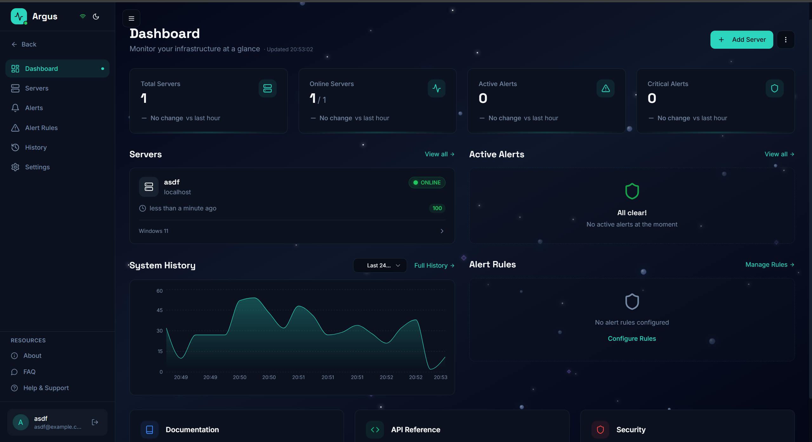

```tsx
<MetricCard title="Total Servers" value={summary?.totalServers} icon={<Server />} />
<MetricCard title="Online" value={summary?.online} icon={<CheckCircle />} color="green" />
<MetricCard title="Active Alerts" value={summary?.activeAlerts} icon={<Bell />} color="red" />
```

## 5. Servers Page

Server list with status badges (🟢 Online, 🔴 Critical). **Add Server** button opens a dialog.

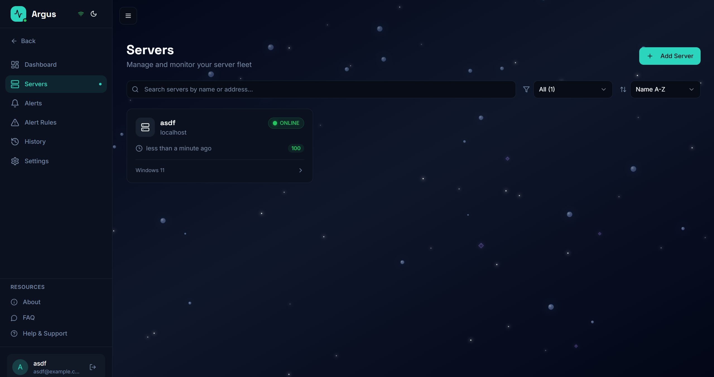

```tsx
<Button onClick={() => setAddOpen(true)}><Plus /> Add Server</Button>
{servers?.map(s => <ServerCard key={s.id} server={s} />)}
```

## 6. Server Detail

4 live charts (CPU, Memory, Disk, Network) updating every 5s via WebSocket — no page refresh needed.

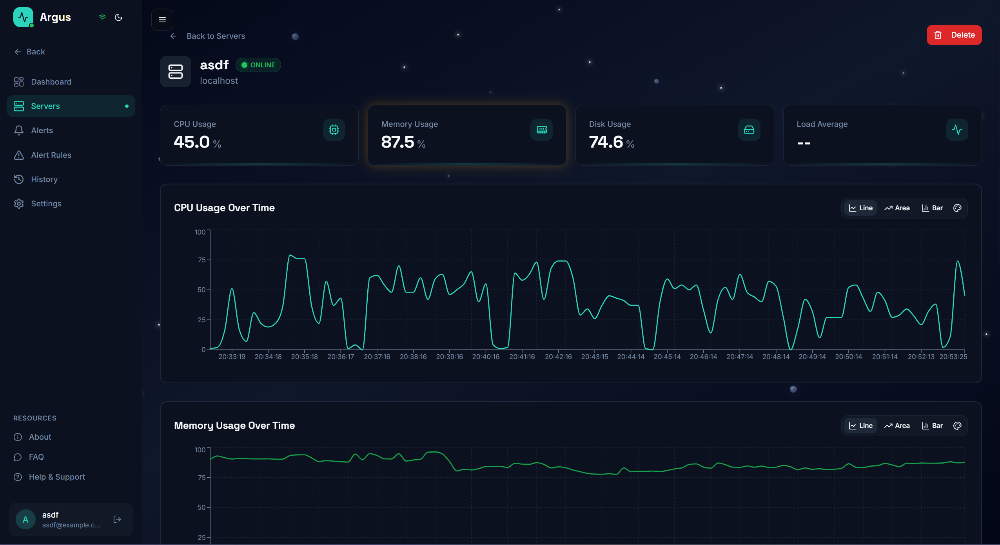

```tsx
client.subscribe(`/topic/server/${id}/metrics`, (msg) => {
  const data = JSON.parse(msg.body);
  setMetrics(prev => [...prev.slice(-60), data]);
});
```

## 7. Alerts Page

All alerts with filter (All / Active / Resolved). Severity shown as CRITICAL 🔴, WARNING 🟡, INFO 🔵.

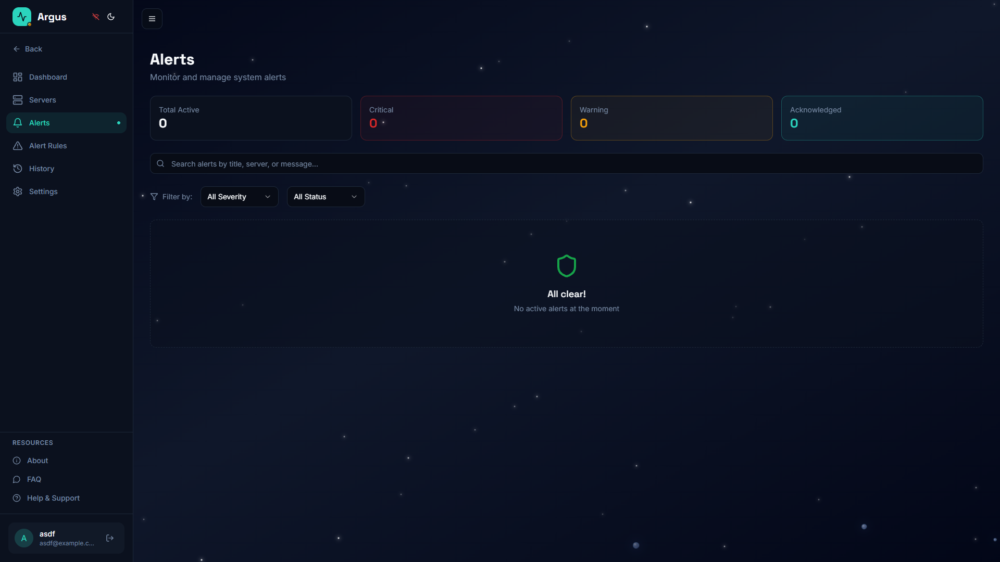

```tsx
{["all", "active", "resolved"].map(f => (
  <Button variant={filter === f ? "default" : "outline"} onClick={() => setFilter(f)}>{f}</Button>
))}
{alerts?.map(a => <AlertCard key={a.id} alert={a} />)}
```

## 8. Alert Rules

Create rules like "Alert when CPU > 85%". Each rule has an on/off toggle.

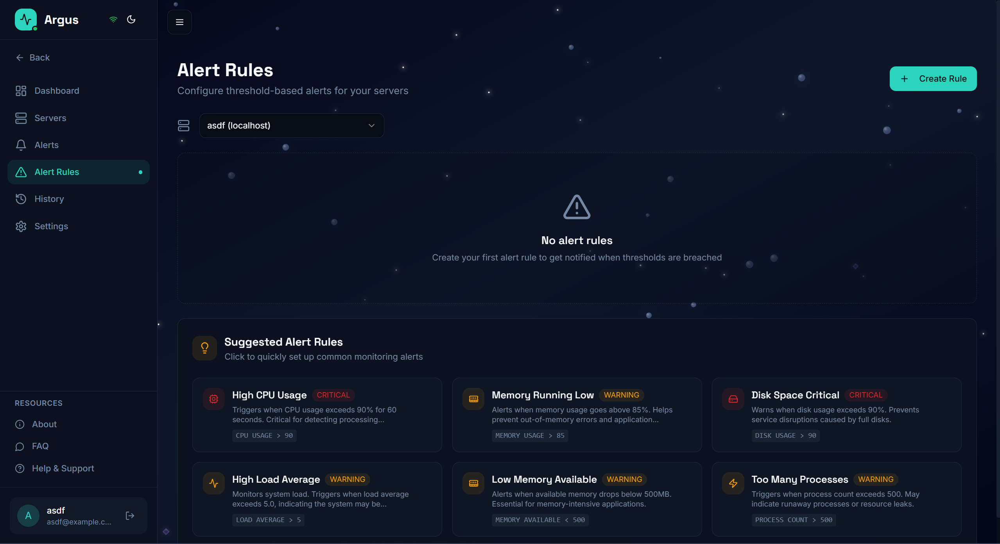

```tsx
<TableCell>{rule.metric}</TableCell>
<TableCell>{rule.threshold}%</TableCell>
<TableCell><Switch checked={rule.enabled} onCheckedChange={() => toggleRule(rule.id)} /></TableCell>
```

## 9. History Page

Select server + time frame (1h → 30d) → view chart → export as PNG/PDF/CSV/JSON.

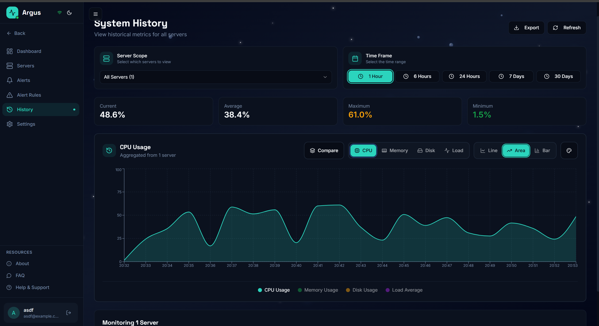

```tsx
<ServerSelector value={serverId} onChange={setServerId} />
<TimeFrameSelector value={timeFrame} onChange={setTimeFrame} />
<AreaChart data={historyData} />
{["PNG", "PDF", "CSV", "JSON"].map(fmt => (
  <Button onClick={() => handleExport(fmt)}>Export {fmt}</Button>
))}
```

## 10. Settings

Profile editing, email alert toggle, dark/light theme switch.

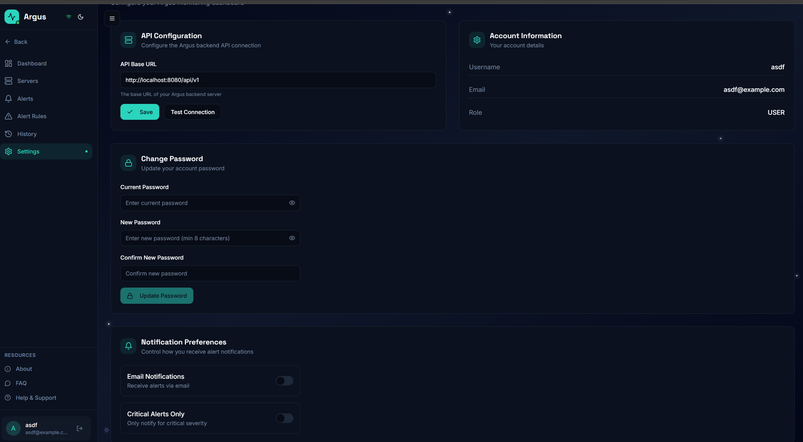

```tsx
<Switch checked={emailAlerts} onCheckedChange={setEmailAlerts} /> {/* Email toggle */}
<ThemeToggle /> {/* Dark/Light mode */}
```

---

## Reusable Components

**Sidebar** — Left navigation, always visible. Active page is highlighted. WebSocket status indicator (🟢/🔴).


**StatusBadge** — Color-coded labels: Online (green), Warning (yellow), Critical (red), Offline (gray).

**MetricCard** — Displays a single metric (e.g., CPU: 72%) with icon and optional trend arrow.

**ThemeToggle** — Switches dark ↔ light mode. Saved in localStorage so it persists across refreshes.

---

## User Interaction Flows

### Flow 1: Register → Login → Dashboard

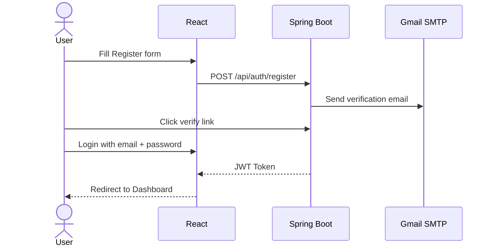

### Flow 2: Dashboard → Server → Live Charts

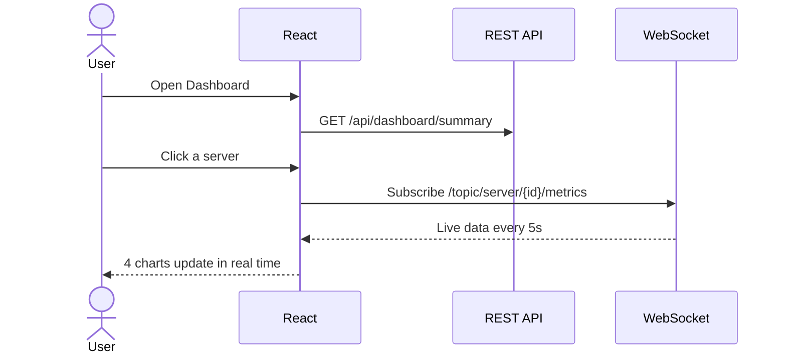

### Flow 3: Create Alert Rule → Get Alert

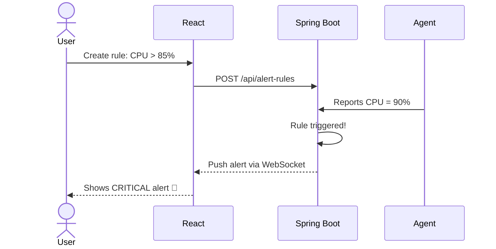

### Flow 4: History → Export

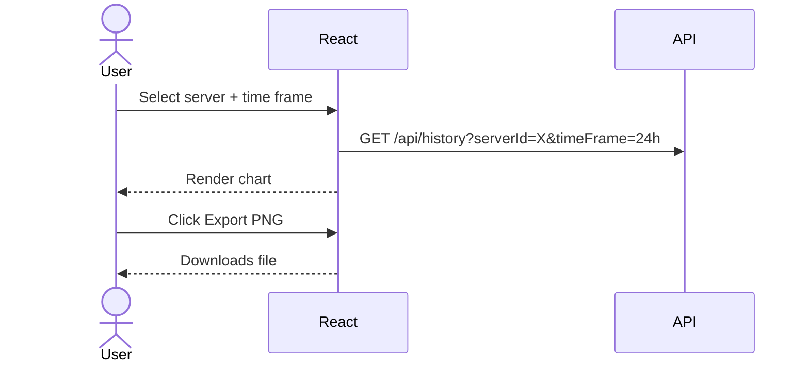

---

## Summary

| Feature | Implementation |
| --- | --- |
| Pages | 10 pages covering all monitoring tasks |
| Components | Sidebar, MetricCard, StatusBadge, ServerCard, AlertCard, ThemeToggle |
| Real-time | WebSocket charts updating every 5 seconds |
| Security | JWT tokens protect all pages |
| Export | PNG, PDF, CSV, JSON from History page |
| Theme | Dark/light mode saved in localStorage |
| Alerts | Email notifications + in-app alerts with severity badges |
