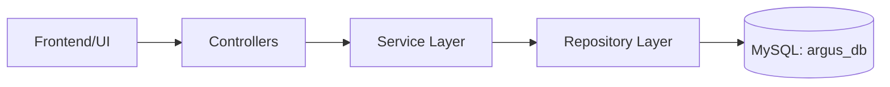
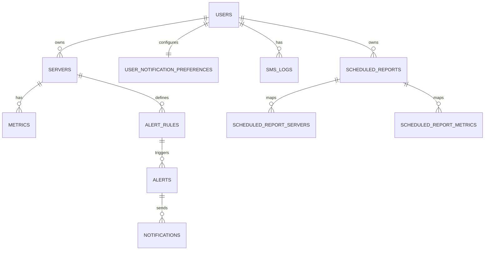

# Assignment 8 - Data Access Layer (DAL) and Testing

Course: CS 331 (Software Engineering Lab)  
Project: Argus (Server Monitoring System)  
Team: NightsWatch

---

## Part A. Data Access Layer (DAL) [20]

The DAL in Argus is implemented using Spring Data JPA.

### 1) Database and table creation

- Database engine: MySQL
- Database name: `argus_db`
- Schema management: `spring.jpa.hibernate.ddl-auto=update`
- Effect: when backend starts, entity mappings are used to create/update tables automatically.

Minimal setup SQL:

```sql
CREATE DATABASE IF NOT EXISTS argus_db;
USE argus_db;
```

### 2) Tables created (verified using `SHOW TABLES`)

| Table Name | Purpose |
| --- | --- |
| `users` | Stores account details and auth-related fields |
| `servers` | Stores monitored servers and ownership |
| `metrics` | Time-series metric values from agent ingestion |
| `alert_rules` | User-defined threshold rules |
| `alerts` | Triggered alert instances and lifecycle state |
| `notifications` | Email/SMS notification records per alert |
| `user_notification_preferences` | Per-user email/SMS preference settings |
| `sms_logs` | Detailed SMS delivery/audit logs |
| `scheduled_reports` | Saved report definitions |
| `scheduled_report_servers` | Mapping of report to server IDs |
| `scheduled_report_metrics` | Mapping of report to metric types |

### 3) DAL code components implemented

- Entity classes: `src/main/java/nightswatch/argus/entity/*`
- Repository interfaces: `src/main/java/nightswatch/argus/repository/*`
- Service layer uses repositories for all CRUD and query operations.

Main repository modules:

1. `UserRepository` -> user lookup, uniqueness checks
2. `ServerRepository` -> server ownership/status/heartbeat queries
3. `MetricRepository` -> latest metrics, time-range queries, aggregation
4. `AlertRuleRepository` -> enabled rule retrieval by server/metric
5. `AlertRepository` -> active/open/resolved alert queries
6. `NotificationRepository` -> pending/failed/retry notification queries
7. `UserNotificationPreferenceRepository` -> per-user preference storage
8. `SmsLogRepository` -> rate-limit and delivery analytics queries
9. `ScheduledReportRepository` -> due report and owner report queries

### 4) Simple DAL interaction diagram





---

## Part B. Testing

### B1) White Box Testing (Branch/Logic based) [10]

These cases were designed using internal code knowledge and executed against API flows that trigger specific branches.

| ID | Internal logic covered | Input/Action | Expected result | Actual result | Status |
| --- | --- | --- | --- | --- | --- |
| WB-01 | `UserService.register` duplicate username check | Register with existing username | 400 + "Username already taken" | 400 + "Username already taken" | Pass |
| WB-02 | `UserService.register` duplicate email check | Register with existing email | 400 + "Email already registered" | 400 + "Email already registered" | Pass |
| WB-03 | `JwtService.isTokenValid` invalid token branch | Verify endpoint with invalid token | 400 + "Invalid token" | 400 + "Invalid token" | Pass |
| WB-04 | `UserService.login` unverified-email branch | Login with unverified user | 400 + verification required message | 400 + verification required message | Pass |
| WB-05 | DTO validation branch in `AuthController` | Login with blank password | 400 + validation error | 400 + validation error | Pass |

### B2) Black Box Testing (Functional/API behavior) [10]

These cases were executed as endpoint-level tests without depending on internal implementation details.

| ID | Test case | Input | Expected output | Actual output | Status |
| --- | --- | --- | --- | --- | --- |
| BB-01 | Register with invalid email format | `/api/v1/auth/register` invalid email | 400 Validation failed | 400 Validation failed | Pass |
| BB-02 | Verify with invalid JWT token | `/api/v1/auth/verify` invalid token | 400 Invalid token | 400 Invalid token | Pass |
| BB-03 | Login with missing password | `/api/v1/auth/login` blank password | 400 Validation failed | 400 Validation failed | Pass |
| BB-04 | Register with valid new user data | `/api/v1/auth/register` valid payload | 201 User registered successfully | 201 User registered successfully | Pass |
| BB-05 | Login before email verification | `/api/v1/auth/login` with unverified account | 400 Email not verified | 400 Email not verified | Pass |

### Test execution proof (performed)

1. Automated backend test run (`./mvnw test`) completed successfully.
   - `ArgusApplicationTests`: Tests run = 1, Failures = 0, Errors = 0, Skipped = 0
2. Manual API execution for WB + BB cases (via `curl`) completed.
   - Total executed cases in this assignment: 10
   - Passed: 10
   - Failed: 0

---

## Short conclusion

DAL implementation is already present and functional through JPA entities + repositories backed by MySQL. Both white box (logic/branch focused) and black box (functional API) testing were executed, and all selected test cases passed.
